theme: NUSTEM 2 (Titillium)
slide-dividers: #
autoscale: true

# [fit] THINGS
## [fit] WHAT WE DONE

# [fit] Starting points

##     

## Terrible coding, mostly in C
## ...that's about it

# [fit] 8'22"

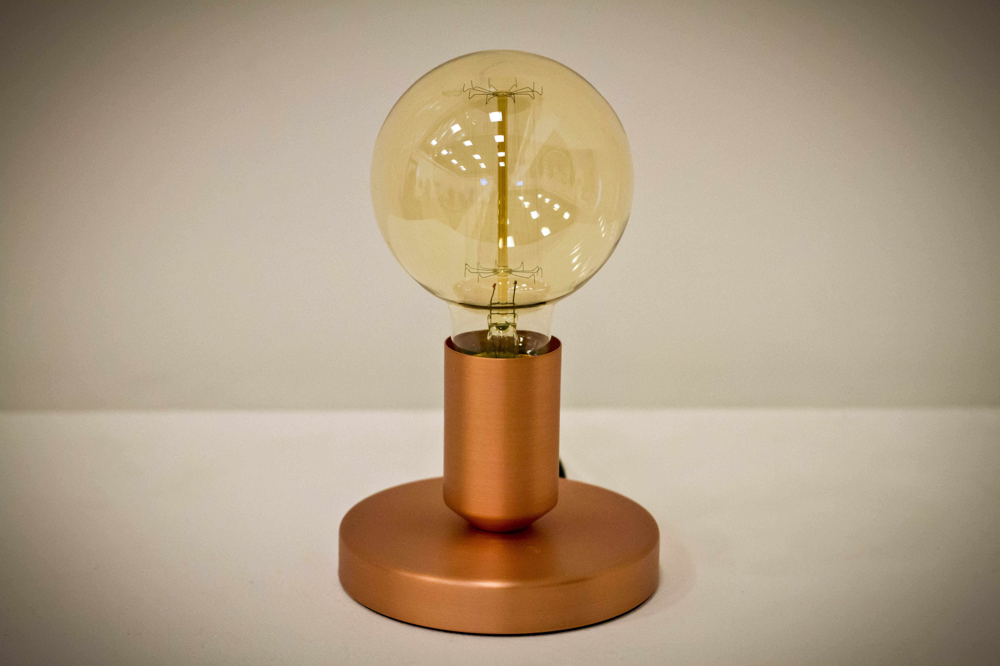

# [fit] Wheel of Fortune

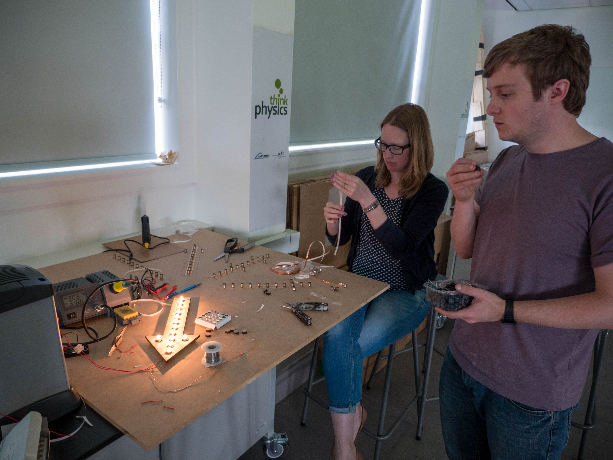
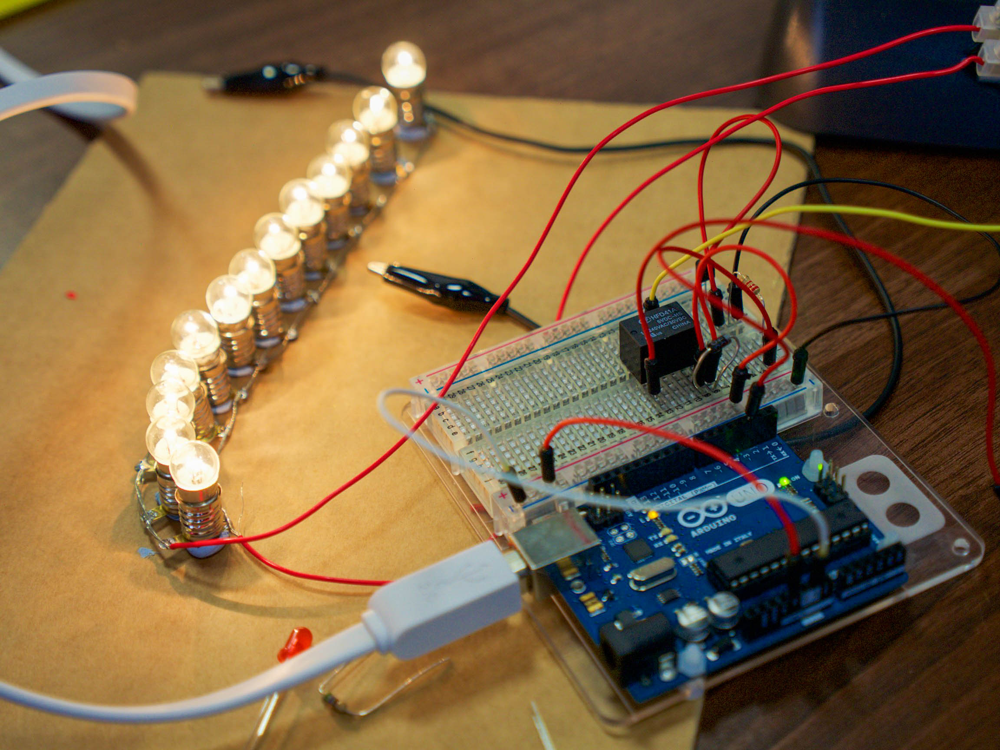

---
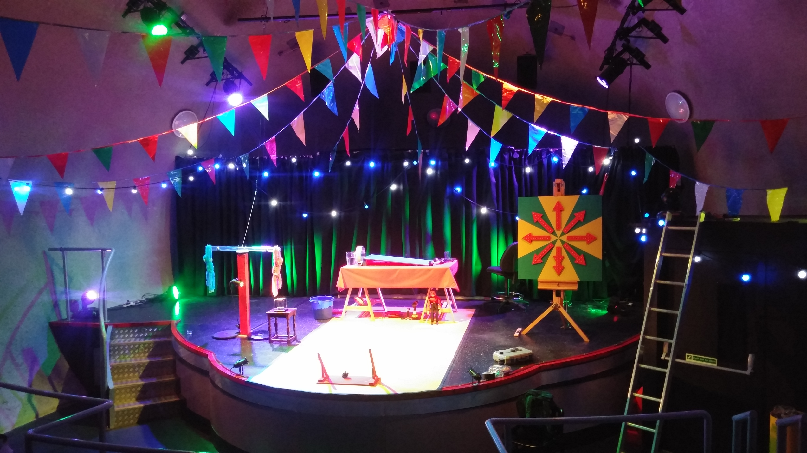

---

---
<!--  -->
<!--  -->

# [fit] Pendulum Wave

* Arduino / TouchBoard
* Capacitance sensors (analogue inputs)
* NeoPixels
* MIDI output / sound generation

But:

* Awful C which none of us understand
* Passive visitor experience

# [fit]Light Wall

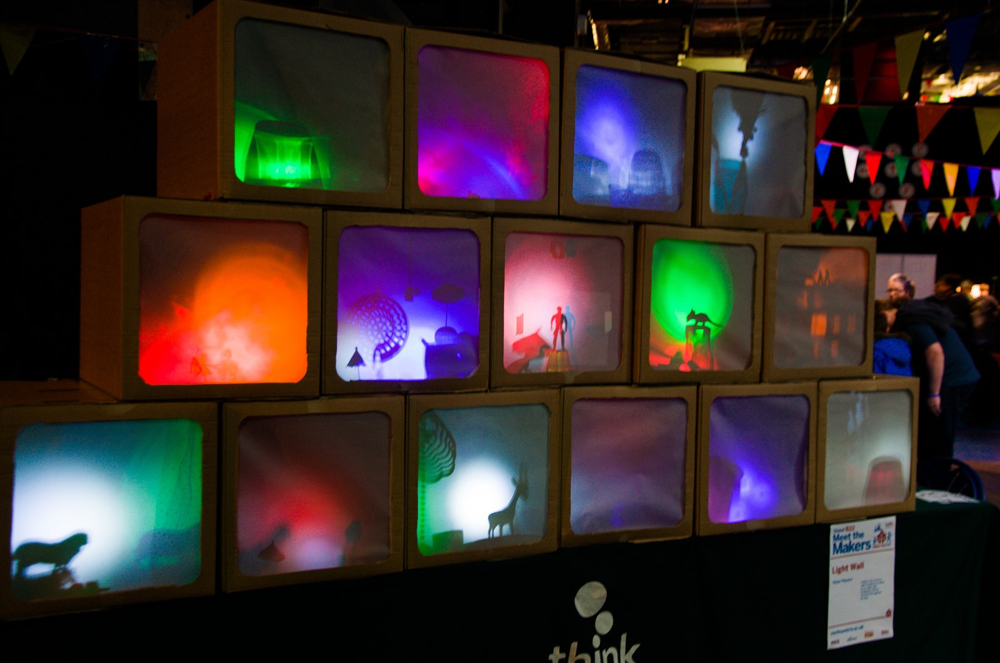

* Arduino/Trinket
* NeoPixel
* Power circuitry
* Analogue input
...
* Didn't read the docs
* Questionable hardware choices

# [fit] Robot Orchestra v1

* Arduino
* Servos
* Tinkering, with added electronics

# [fit] Christmas Tree

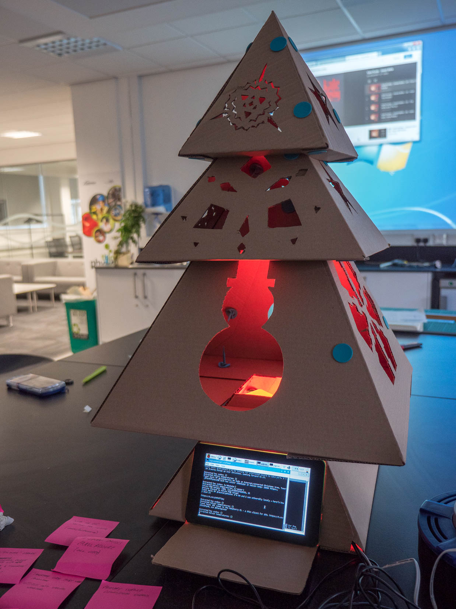

* Raspberry Pi
* Python
* NeoPixels
* Twitter
* ...
* 1-day hack
* Github collaboration

# [fit] Technology Wishing Well

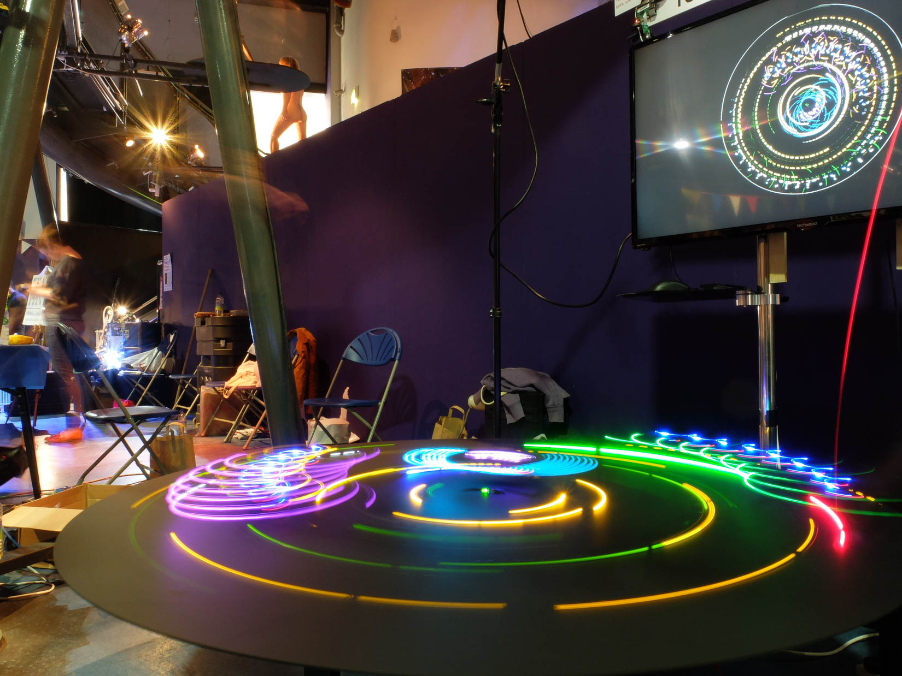

# [fit] Technology Wishing Well

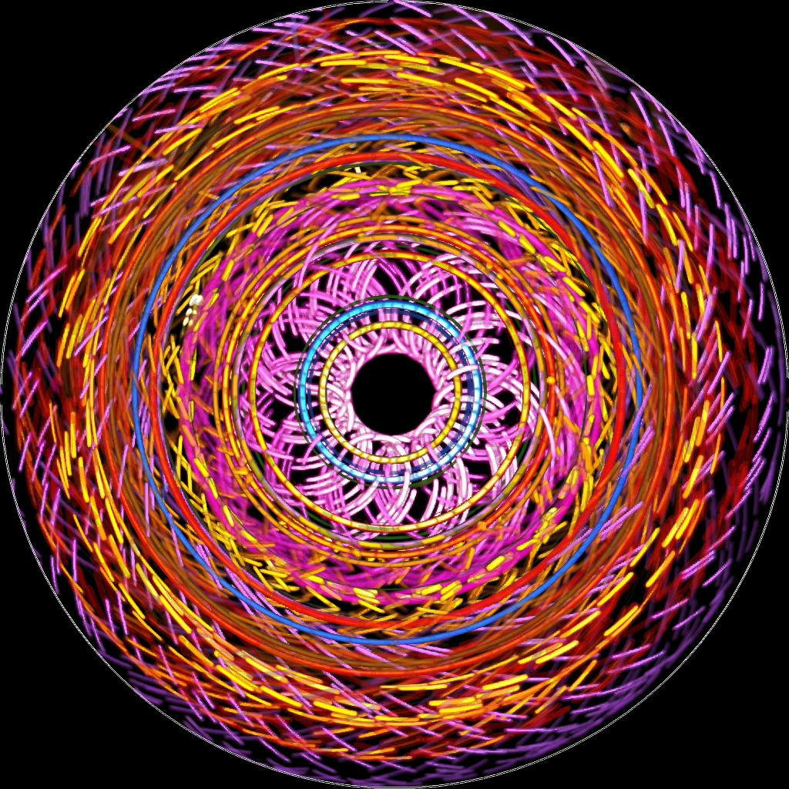

|  |  |  |
| --- | --- | --- |
| Raspberry Pi | NeoPixels | Github |
| Picamera | Pygame | ESP8266/Arduino |
| Servos | Numpy | MQTT | Twitter |
| PyQT4 GUI | PIL | GPIOZero |

# [fit] Technology Wishing Well

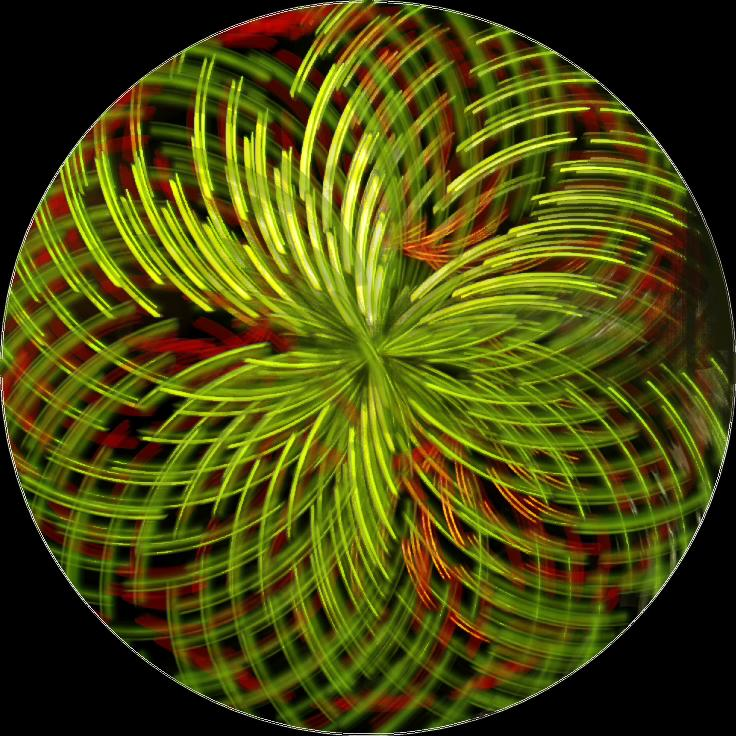

* Small pieces, loosely joined
* Reusable code
* Multiplatform
* Message passing
* Design for visitor experience

# Robot Orchestra v2

* ESP8266/Arduino
* MQTT
* Servos
* Raspberry Pi
* Python

# Robot Orchestra v2

* Technology Wishing Well...
  * ...upside-down
  * Without the camera
  * With drums 

# [fit] Naffulus Pi

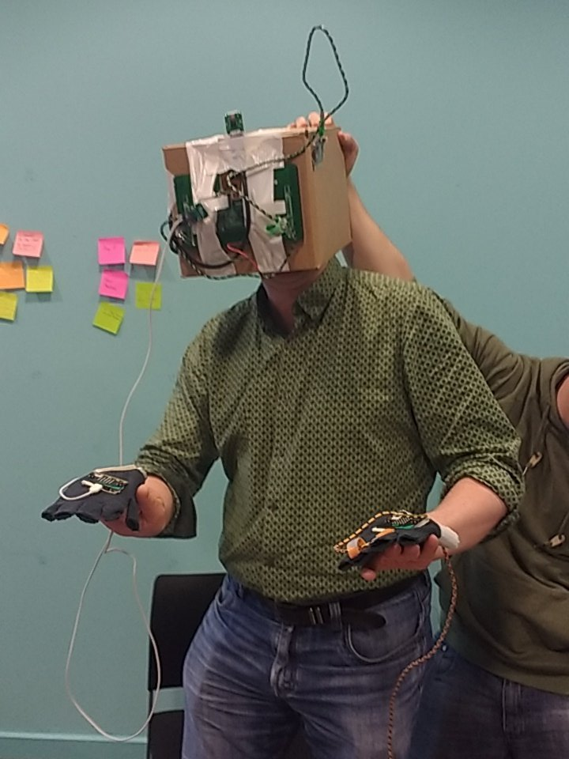

| | | |
| --- | --- | --- |
| Arduino | micro:bit | Raspberry Pi |
| GPIOzero | picamera | Python |
| Motion || Minecraft |

# [fit] Heart of Maker Faire

| | | | |
| --- | --- | --- | --- |
| Raspberry Pi | ESP8266 | Python | Picamera |
| NeoPixels | GPIOzero | Thermal printer | MQTT |
| QR codes | MySQL | more NeoPixels | Processing
| **EVEN MORE NEOPIXELS** | | No really, _all_ the NeoPixels | 

---

# [fit] Robot Orchestra v3

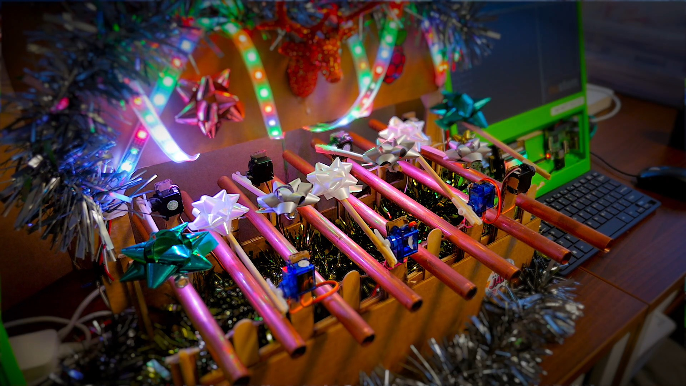

| | | |
| --- | --- | --- |
| Raspberry Pi | ESP8266 | MQTT |
| UNTZtrument | Github | Fuzzywuzzy |
| Ringtones | Twitter | pigpiod |
| JSON |  |  |

---

---

# [fit] Pirograph

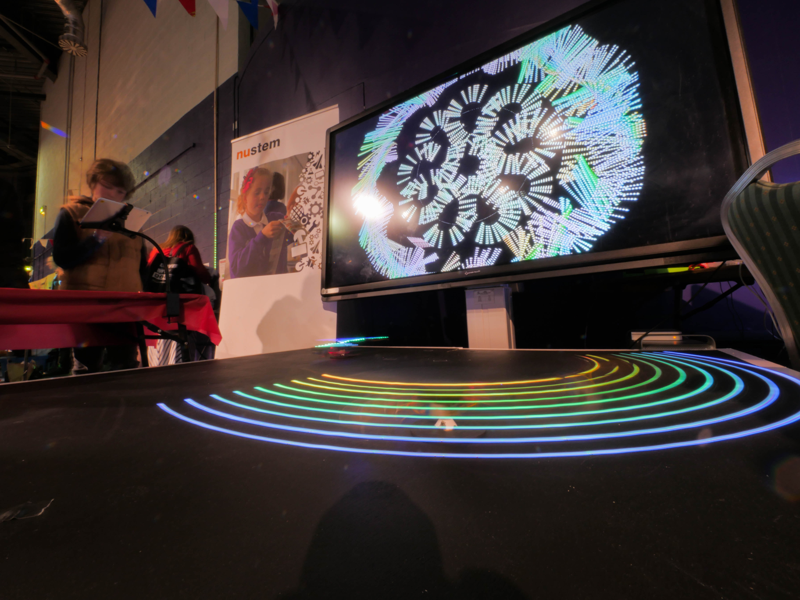

* Flask 
(Python web application framework)
* Performance profiling
* Processing
* "ScutterZero"

