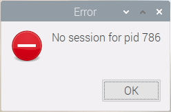
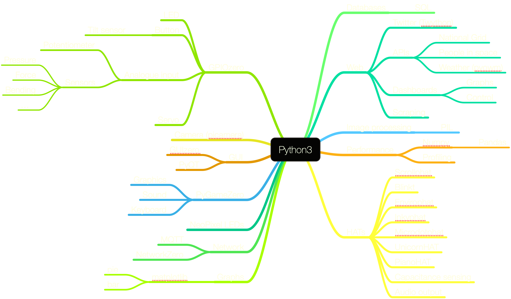

footer: NUSTEM, 2019
slidenumbers: true
theme: NUSTEM 2 (Titillium)
slide-dividers: #

# [fit] Digital Making

### workshop day for Our Dynamic Earth[^1], August 2019


[^1]: (and the Centre for Life)


# The Plan

- Build confidence in digital making
- Have some ideas for future direction
- ...
- Profit!

# The Plan

- Build confidence in digital making
- Have some ideas for future direction
- Lunch
- Profit!

# The Plan

- Build confidence in digital making
- Lunch
- Have some ideas for future direction
- Profit!

# The approach

- Learn by doing real stuff
- Make deliberate choices about technologies
- Crib from others, continuously
- ...

# Python 


# [fit] FLASHING 
## [fit] LIGHTS


# Pi quirks

  
  
If you see an error like this, the menus won't work. You'll need:

`sudo shutdown -h now`

or:

`sudo reboot`


# [fit] FLASHING 
## [fit] LIGHTS

# Python functions

```python
def sequence():
    red.on()
    sleep(1.0)
    ...
    red.off()

sequence()
```

# [fit] Python functions with variables

```python
def sequence(delay):
    red.on()
    sleep(delay)
    ...
    red.off()
    
sequence(0.7)
```

# Flashing Lights

- There's no single 'correct' way...
    - ...but conventions are useful
- Instructions are *hard*
- Libraries
- Documentation
- Experimentation

# [fit]Programming as 
## [fit]**Digital Lego**

---


# How to approach coding

- Build real projects
- Work together
- Write for future projects
- Build on previous projects

# How to approach coding (2)

- Choose common libraries
  - How recently updated?
  - awesome-python.com
- ~~Read~~ Skim documentation
  - Stick close to examples: choose challenges carefully
  - ~~Borrow~~ Steal from StackExchange

# How to approach coding (3)

1. Make it work
2. Make it right
3. Make it fast
    *"Premature optimisation is the root of all evil."*
    — Donald Knuth

# [fit] teaching,
## [fit] making, 
## [fit] tinkering
