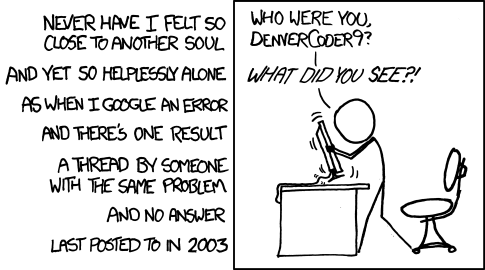

footer: NUSTEM, 2019
slidenumbers: true
theme: NUSTEM 2 (Titillium)
slide-dividers: #

# [fit] Digital Making

### workshop day for Our Dynamic Earth[^1], August 2019


[^1]: (and the Centre for Life)

# [fit] OBLIGATORY
## [fit] SAFETY
## [fit] MESSAGES

# The Plan

- Build confidence in digital making
- Have some ideas for future direction
- ...
- Profit!

# The Plan

- Build confidence in digital making
- Have some ideas for future direction
- Lunch
- Profit!

# The Plan

- Build confidence in digital making
- Lunch
- Have some ideas for future direction
- Profit!

# The Approach

- Learn by doing real stuff
- Make deliberate choices about technologies
- Crib from others, continuously
- ...

# Cribbing from others



# [fit] FLASHING 
## [fit] LIGHTS


# Pi quirks

  
  
If you see an error like this, the shutdown menu won't work. You'll need:

`sudo shutdown -h now`

or:

`sudo reboot`

...in a Terminal.

# [fit] FLASHING 
## [fit] LIGHTS

# Python functions

```python
def sequence():
    red.on()
    sleep(1.0)
    ...
    red.off()

sequence()
```

# [fit] Python functions with variables

```python
def sequence(delay):
    red.on()
    sleep(delay)
    ...
    red.off()

sequence(0.7)
```

# Flashing Lights

- There's no single 'correct' way...
    - ...but conventions are useful
- Instructions are *hard*
- Libraries
- Documentation
- Experimentation

# [fit]Programming as 
## [fit]**Digital Lego**

# [fit]Carousel

# Pi quirks (2)


---

| Activity  | Difficulty  | Where?  |
| --- | --- | --- |
| Toggle Switches & RGB LEDs | Easy | Side Station → |
| Electricity Generation API | Hardish | ← Main Table |
| Cameras, buttons and Twitter | Moderate | Side Station → |
| Weather APIs | Easy... or insanely hard | Side Station → |
| Envirocorn | Medium | Side Station → |
| People in Spaaaaace | Medium | ← Main Table |
| PyGame Zero | Hard, because badly-written | ← Main Table |
| Motors, Lights and Buttons | Hard | Side Station → |
| Analogue Input | Easy-ish? | Side Station → |

---

